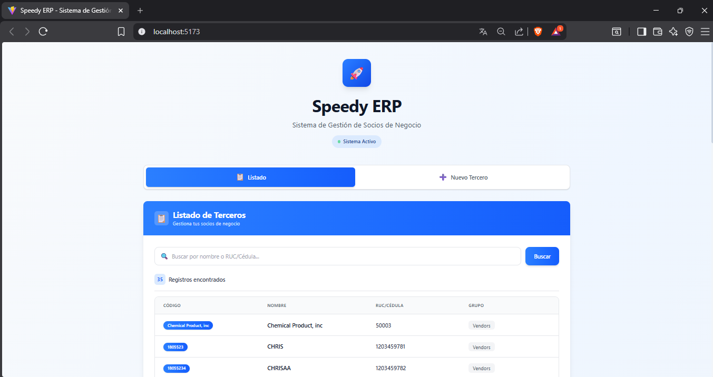
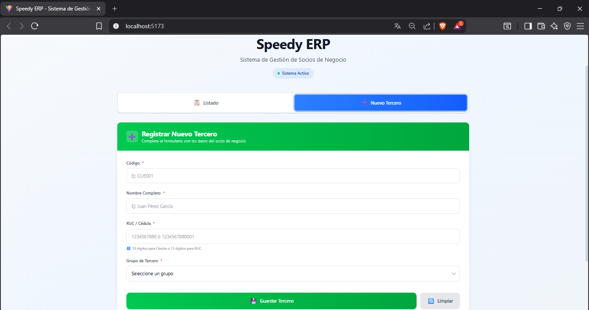

# 🚀 Speedy ERP - Sistema de Gestión de Socios de Negocio

[](https://nodejs.org/)
[](https://reactjs.org/)
[](https://www.oracle.com/database/)

> Aplicación web fullstack para consulta y registro de terceros en iDempiere ERP

**Prueba Técnica** - Departamento de Tecnología e Innovación de Speedy

---

## 📋 Descripción

Sistema web que permite gestionar socios de negocio (terceros) conectado directamente a una base de datos Oracle iDempiere ERP.

Video mostrando funcionalidad: [Video](https://www.loom.com/share/66553ccc0ccd447bb421490d74a7c6a1)

### Funcionalidades Principales

- ✅ **Consultar** terceros existentes con filtro de búsqueda por nombre o RUC/Cédula
- ✅ **Registrar** nuevos socios de negocio con validaciones
- ✅ **Validación** de formato RUC/Cédula ecuatoriana (10 o 13 dígitos)
- ✅ **Interfaz responsiva** optimizada para móvil, tablet y desktop
- ✅ **Seguridad** contra SQL Injection mediante prepared statements

---

## 🛠️ Stack Tecnológico

### Backend
- **Node.js** 20+
- **Express.js** 4.21 - Framework web
- **oracledb** 6.7 - Driver Oracle oficial
- **dotenv** - Manejo de variables de entorno
- **cors** - Control de acceso CORS

### Frontend
- **React** 19 con Hooks
- **Vite** 7 - Build tool
- **Tailwind CSS** 4 - Estilos
- **Axios** - Cliente HTTP

---

## 📁 Estructura del Proyecto

```
speedy-erp-test/
│
├── backend/                    # API REST
│   ├── src/
│   │   ├── config/
│   │   │   └── database.js     # Configuración Oracle
│   │   ├── controllers/
│   │   │   └── BPartnerController.js
│   │   ├── models/
│   │   │   └── BPartnerModel.js
│   │   ├── routes/
│   │   │   └── BPartnerRoutes.js
│   │   ├── utils/
│   │   │   └── validators.js   # Validaciones
│   │   └── app.js
│   ├── server.js               # Punto de entrada
│   ├── package.json
│   ├── .env.example            # Template de configuración
│   └── .gitignore
│
└── frontend/                   # Cliente React
    ├── src/
    │   ├── components/
    │   │   ├── BPartnerList.jsx    # Lista de terceros
    │   │   └── BPartnerForm.jsx    # Formulario de registro
    │   ├── services/
    │   │   └── api.js              # Cliente Axios
    │   ├── App.jsx
    │   ├── main.jsx
    │   └── index.css
    ├── index.html
    ├── package.json
    ├── vite.config.js
    └── .gitignore
```

---

## ⚙️ Requisitos Previos

- **Node.js** versión 20 o superior
- **npm** o **yarn**
- Acceso a base de datos **Oracle** (iDempiere ERP)
- Credenciales de conexión proporcionadas por Speedy

---

## 🚀 Instalación y Configuración

### 1️⃣ Clonar el Repositorio

```bash
git clone https://github.com/tu-usuario/speedy-erp-test.git
cd speedy-erp-test
```

### 2️⃣ Configurar Backend

```bash
# Navegar a la carpeta backend
cd backend

# Instalar dependencias
npm install

# Configurar variables de entorno
cp .env.example .env
```

**Editar archivo `.env`** con tus credenciales:

```env
PORT=3000
NODE_ENV=development

DB_USER=tu_usuario
DB_PASSWORD=tu_password
DB_HOST=190.99.72.176
DB_PORT=1521
DB_SID=RSA
```

### 3️⃣ Configurar Frontend

```bash
# Desde la raíz del proyecto
cd frontend

# Instalar dependencias
npm install
```

---

## 🎬 Ejecución del Proyecto

### Opción 1: Ejecución Manual (2 terminales)

**Terminal 1 - Backend:**
```bash
cd backend
npm run dev
```
> 🟢 Servidor corriendo en `http://localhost:3000`

**Terminal 2 - Frontend:**
```bash
cd frontend
npm run dev
```
> 🟢 Aplicación corriendo en `http://localhost:5173`

### Opción 2: Script de Inicio Simultáneo (Opcional)

Puedes crear un script en la raíz del proyecto para iniciar ambos servicios.

---

## 📡 Endpoints de la API

### Base URL
```
http://localhost:3000/api
```

### Endpoints Disponibles

| Método | Endpoint | Descripción | Parámetros |
|--------|----------|-------------|------------|
| `GET` | `/bpartners` | Listar todos los terceros | `?search=` (opcional) |
| `POST` | `/bpartners` | Crear nuevo tercero | Body JSON |
| `GET` | `/bpartners/groups` | Obtener grupos de terceros | - |

### Ejemplo de Request

**GET /api/bpartners?search=Juan**
```bash
curl http://localhost:3000/api/bpartners?search=Juan
```

**POST /api/bpartners**
```bash
curl -X POST http://localhost:3000/api/bpartners \
  -H "Content-Type: application/json" \
  -d '{
    "value": "CLIE001",
    "name": "Juan Pérez",
    "taxId": "1234567890",
    "groupId": 100
  }'
```

---

## 🔒 Seguridad Implementada

### Prevención SQL Injection
- ✅ Uso de **prepared statements** con binding de parámetros
- ✅ Validación de inputs en frontend y backend
- ✅ Sin concatenación directa de strings en SQL

```javascript
// Ejemplo de consulta segura
await connection.execute(
    `SELECT * FROM C_BPARTNER WHERE NAME LIKE :search`,
    { search: `%${searchTerm}%` }  // Parámetro enlazado
);
```

### Validación de Datos
- ✅ Formato de RUC/Cédula ecuatoriana
- ✅ Campos obligatorios
- ✅ Tipos de datos correctos

---

## 📱 Diseño Responsivo

La interfaz se adapta a diferentes dispositivos:

### 📱 Móvil (320px - 767px)
- Vista de **cards verticales** con toda la información
- Botones adaptados con iconos
- Búsqueda en formato vertical

### 💻 Tablet (768px - 1023px)
- Layout optimizado para pantallas medianas
- Información en grid de 2 columnas

### 🖥️ Desktop (1024px+)
- **Tabla horizontal** completa
- Navegación optimizada
- Mayor densidad de información

---

## ✨ Características Destacadas

### Frontend
- 🎨 Diseño moderno con gradientes y sombras
- ⚡ Animaciones suaves de entrada
- 🔄 Estados de carga visuales
- ✅ Validaciones en tiempo real
- 📊 Feedback visual de errores y éxitos

### Backend
- 🔐 Conexión segura a Oracle
- 🆔 Generación automática de IDs (1000-5000)
- 🔍 Búsqueda por nombre o RUC/Cédula
- 📝 Validación de formato ecuatoriano

---

## 🎯 Criterios de Evaluación Cumplidos

| Criterio | Estado | Implementación |
|----------|--------|----------------|
| **Arquitectura** | ✅ | Frontend y Backend completamente separados |
| **Manejo de IDs** | ✅ | Generación automática en backend (1000-5000) |
| **Seguridad SQL** | ✅ | Prepared statements con parámetros enlazados |
| **UX/UI** | ✅ | Interfaz limpia, moderna y responsiva |
| **Bonus: Validación RUC** | ✅ | Validación de 10 (Cédula) o 13 (RUC) dígitos |

---

## 🧪 Pruebas Realizadas

- ✅ Consulta de terceros existentes
- ✅ Búsqueda por nombre
- ✅ Búsqueda por RUC/Cédula
- ✅ Registro de nuevo tercero
- ✅ Validación de campos obligatorios
- ✅ Validación de formato de identificación
- ✅ Responsividad en diferentes dispositivos

---

## 📸 Screenshots

### Vista Desktop - Listado


### Vista Desktop - Formulario


### Vista Móvil


---

## 🐛 Solución de Problemas

### Error de conexión a Oracle

```
ORA-12170: TNS:Connect timeout occurred
```

**Solución:**
- Verificar credenciales en `.env`
- Confirmar acceso de red al servidor Oracle
- Revisar firewall/VPN

### Puerto 3000 ya en uso

```bash
# Cambiar puerto en .env
PORT=3001
```

### Error de dependencias

```bash
# Limpiar caché y reinstalar
rm -rf node_modules package-lock.json
npm install
```

---


## 👨‍💻 Autor

**Stalyn David Palma Quiroz**

- Email: [stalinpalma35@gmail.com]
- LinkedIn: [www.linkedin.com/in/stalyn-palma-180b0217b]
- GitHub: [sdpalmaq](https://github.com/Sdpalmaq)

---
 
## 📄 Información del Proyecto

- **Empresa:** Speedy
- **Tipo:** Prueba Técnica
- **Departamento:** Tecnología e Innovación
- **Supervisor:** Andrés López Andrade
- **Fecha:** Febrero 2026

---

## 📝 Notas Importantes

- Este proyecto es una **prueba técnica privada**
- Las credenciales de acceso son confidenciales
- No distribuir ni hacer público sin autorización
- Desarrollado siguiendo las especificaciones del documento técnico

---

## 🙏 Agradecimientos

Agradezco a Speedy por la oportunidad de participar en este proceso de selección y demostrar mis habilidades técnicas.

---

<div align="center">

**Desarrollado con ❤️ para Speedy**

</div>
```